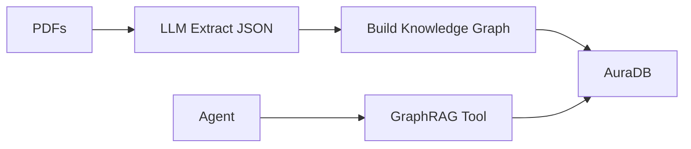
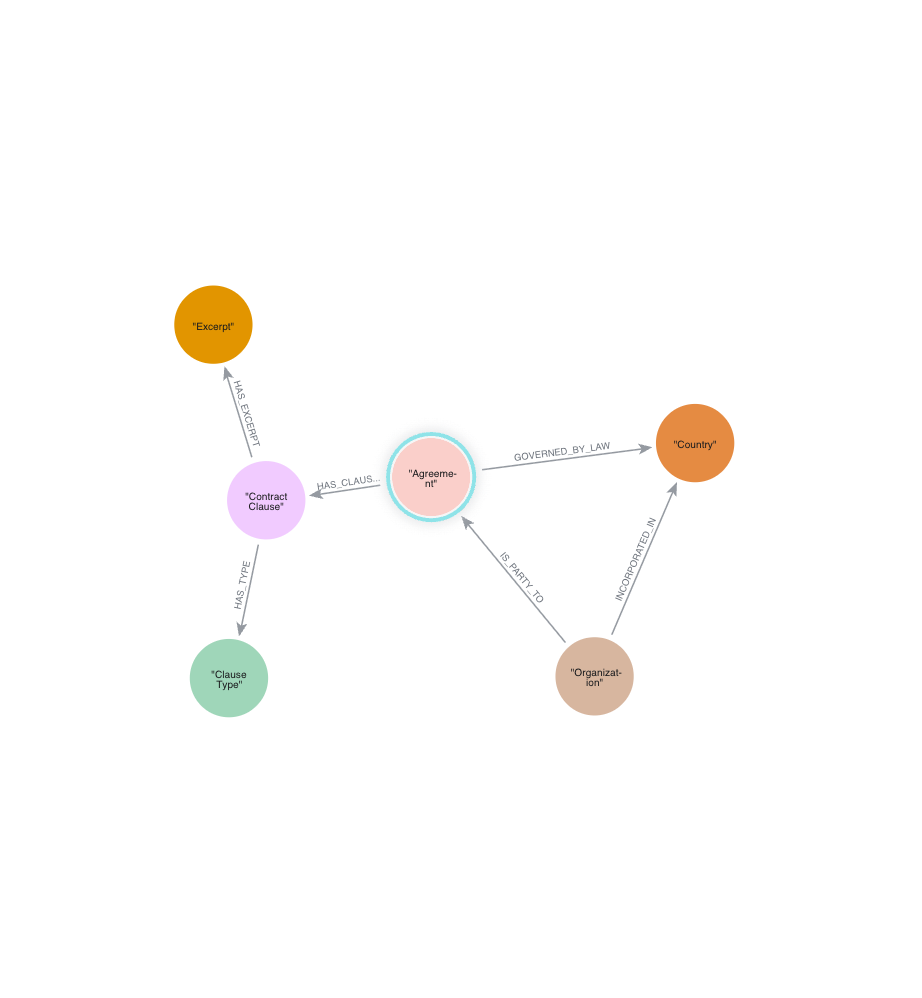

# GraphRAG with Microsoft Agent Framework, Azure AI Foundry and Neo4j

A demo project for building intelligent contract analysis agents using
Graph Retrieval-Augmented Generation.

## Overview

Demonstrates building AI agents for contract analysis using GraphRAG: combining knowledge graphs
with LLM reasoning for intelligent document analysis.

**Stack:**

- **Microsoft Agent Framework** - AI agents and multi-agent workflows
- **Azure AI Foundry** - Azure OpenAI for LLMs and embeddings
- **Neo4j** - Graph database with vector search
- **GraphRAG** - Retrieval-augmented generation with graph context

> Based on [Neo4j's GraphRAG Contract Review](https://github.com/neo4j-product-examples/graphrag-contract-review),
> adapted to use Microsoft Agent Framework

## Workflow



## Prerequisites

- Python 3.12+
- [uv](https://github.com/astral-sh/uv) package manager
- Azure AI Foundry with Azure OpenAI (GPT-4o)
- Azure CLI
- Neo4j ([Aura Free](https://neo4j.com/cloud/aura-free/) or local via Docker)

## Neo4j Setup

**Local (Docker Compose):**

```bash
docker compose up -d  # Neo4j Browser: http://localhost:7474
```

**Cloud (Aura Free):**

Sign up at [neo4j.com/cloud/aura-free](https://neo4j.com/cloud/aura-free/)
and update `.env` with connection details

## Quick Start

```bash
# 1. Install dependencies
uv sync

# 2. Configure environment
cp .env.example .env
# Edit .env with your Azure OpenAI and Neo4j credentials

# 3. Authenticate with Azure
az login

# 4. Extract contracts (optional - sample data already in data/output)
uv run 01_extract_contracts.py

# 5. Build knowledge graph
uv run 02_build_graph.py

# 6. Run interactive agent demo
uv run 03_agent.py
```

## Pipeline

### 1. Extract Contracts (PDF → JSON)

```bash
# Add PDF contracts to data/input/, then:
uv run 01_extract_contracts.py
```

Extracts structured data using Azure OpenAI: parties, dates, governing law, and 32 clause types.

### 2. Build Knowledge Graph (JSON → Neo4j)

```bash
uv run 02_build_graph.py
```

Creates graph nodes/relationships, indices, and generates embeddings for semantic search.

**Graph Schema:**



The knowledge graph consists of:

- **Agreement** - Contract documents with parties, dates, and governing law
- **Organization** - Companies involved in contracts
- **Country** - Jurisdictions for incorporation and governing law
- **ContractClause** - Individual clauses with types and excerpts
- **ClauseType** - Categorization of contract clauses
- **Excerpt** - Text snippets with embeddings for semantic search

**Relationships:**

- `IS_PARTY_TO` - Links organizations to agreements
- `GOVERNED_BY_LAW` - Links agreements to governing jurisdiction
- `INCORPORATION_IN` - Links organizations to incorporation country
- `HAS_CLAUSE` - Links agreements to their clauses
- `HAS_TYPE` - Links clauses to their types
- `HAS_EXCERPT` - Links clauses to text excerpts

### 3. Run Contract Review Agent

**DevUI (Visual Interface):**

```bash
uv run devui.py
```

Opens browser UI at `http://127.0.0.1:8080` with chat interface and event/trace viewer.

**Terminal (Interactive):**

```bash
uv run 03_agent.py
```

Chat with the agent directly in the terminal.

**Demo mode** (automated queries):

```bash
uv run 03_agent.py --demo
```

**Example queries:**

- "Tell me about contract 1"
- "Find contracts for AT&T"
- "Get contracts with Price Restrictions but without Insurance"
- "Show me contracts mentioning product delivery"
- "How many contracts are in the database?"

## Cypher Queries

The `cypher/` folder contains useful queries for database management and exploration:

- `reset_database.cypher` - Clear all data from Neo4j
- `drop_all_indexes.cypher` - Remove all indices
- `view_graph_schema.cypher` - Visualize the graph structure
- `agreement_context_graph.cypher` - Query agreement relationships

## Development

The project uses `DefaultAzureCredential` for Azure authentication, which automatically uses:

- Azure CLI credentials (`az login`)
- Managed Identity (when deployed to Azure)
- Environment variables (if configured)

All configuration is managed through `.env` file - see `.env.example` for required variables.

## Architecture

The demo consists of four numbered scripts and a core library:

**Pipeline Scripts** (numbered for easy execution):

1. `01_extract_contracts.py` - PDF → JSON extraction
2. `02_build_graph.py` - JSON → Neo4j graph building
3. `03_agent.py` - Terminal agent interface
4. `devui.py` - Browser UI for agent

**Core Library** (`contract_graphrag/` directory):

- **Contract Service** (`contract_graphrag/contract_service.py`) - Neo4j GraphRAG data retrieval
  - Cypher queries for structured data
  - Vector search for semantic similarity
  - Text-to-Cypher for natural language queries
- **Contract Tools** (`contract_graphrag/contract_tools.py`) - Agent function tools
  - Wraps service methods as agent-callable functions
  - Provides clear descriptions for LLM understanding
- **Agent Config** (`contract_graphrag/agent_config.py`) - Shared agent setup
  - Agent creation with tools
  - System instructions for contract review
- **Data Models** (`contract_graphrag/schema.py`, `contract_graphrag/settings.py`, `contract_graphrag/utils.py`)
  - Pydantic models for contracts
  - Configuration management
  - File utilities

## Resources

- [Microsoft Agent Framework](https://learn.microsoft.com/en-us/agent-framework/)
- [Azure AI Foundry](https://learn.microsoft.com/en-us/azure/ai-studio/)
- [Neo4j GraphRAG](https://neo4j.com/docs/cypher-manual/current/genai-integrations/)
- [Original Neo4j Project](https://github.com/neo4j-product-examples/graphrag-contract-review)

## License

MIT License

---

Made by [i💜Agents](https://iloveagents.ai)
